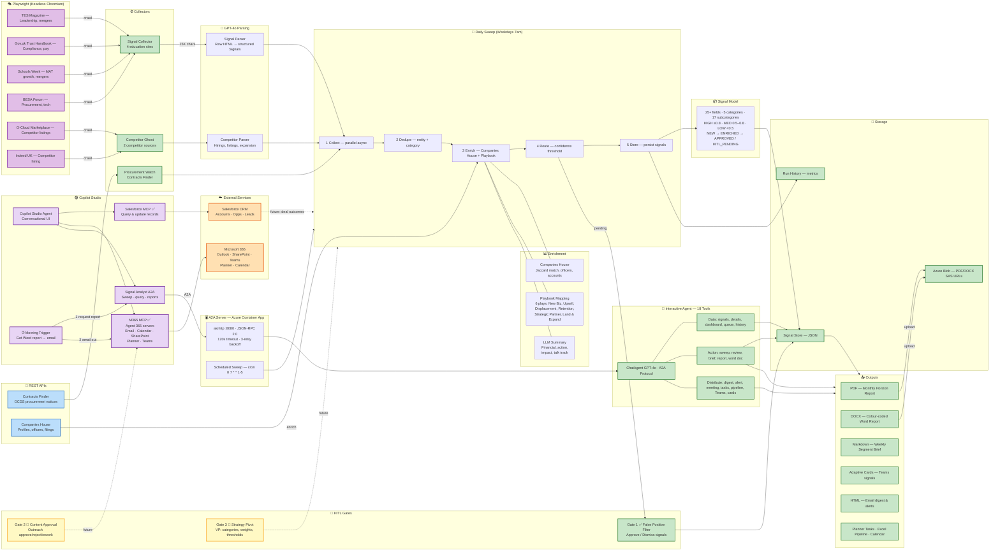

# 🤖 Zava: 8-Agent Signal Intelligence Swarm
**Powered by Microsoft Foundry Agent-to-Agent & Copilot Studio**

Most AI implementations fail because they rely on a single, brittle prompt. **Zava** is an agentic orchestration system that uses 8 specialized "Atomic Agents" to monitor, enrich, and distribute competitive market signals.

## 🚀 Quick Architecture
- **Collection:** 3 Scouts (Web/API/RSS)
- **Enrichment:** 2 Analysts (Financials & Stakeholder Mapping)
- **Action:** 3 Distributors (Teams/CRM/Email)

## 🛠️ Prerequisites
- Microsoft Copilot Studio License
- Access to Microsoft Foundry (Agent-to-Agent Preview)
- Power Automate Premium (for Graph API connectors)
**AI-powered market intelligence agent for the UK education sector, built on Microsoft Copilot Studio.**

---

## The Scenario

Zava is a technology provider selling into UK academy trusts and multi-academy trusts (MATs). The public-sector sales team needs continuous, data-driven intelligence about the organisations they sell to — who is merging, who just posted a procurement notice, who has a new CFO, which trusts are under financial stress, and what competitors are doing in the space.

Manually tracking hundreds of trusts across Companies House filings, government procurement portals, Ofsted reports, and competitor press releases is unsustainable. The team needs an **always-on intelligence engine** that surfaces the signals that matter, filters out noise, and delivers actionable insights directly into the tools they already use — Microsoft Teams, Outlook, Planner, and SharePoint.

### The Ask

> *"We need a Copilot Studio agent that our sales team can talk to in natural language. They should be able to ask 'What's happening with customer X?' or 'Show me all procurement signals from the last week' and get instant, structured answers. When something important is detected, the agent should proactively push alerts to the team via email and Teams. It needs to generate professional Word reports for leadership, create tasks for follow-up, and maintain a pipeline tracker — all without leaving the M365 ecosystem but joining to our CRM System."*

### What We Built

A **multi-agent intelligence platform** with 18 tools, connected to Microsoft Copilot Studio via the [A2A (Agent-to-Agent) protocol](https://a2a-protocol.org/). The platform:

- **Collects signals** by crawling UK government procurement portals (Find a Tender, Contracts Finder), Companies House filings, competitor websites, and education sector news sources using Playwright headless browser automation
- **Enriches signals** with Companies House API data — financial health indicators, officer changes, filing history, and trust structure
- **Classifies signals** into five actionable categories (see below) with confidence scoring
- **Routes high-confidence signals** for automatic activation and low-confidence signals through a human-in-the-loop (HITL) review queue
- **Generates reports** — colour-coded Word documents with executive summaries, category breakdowns, KPI metrics, confidence heat maps, and competitive talk tracks
- **Distributes intelligence** proactively via M365 — email digests, Teams channel posts (Adaptive Cards), Planner tasks, calendar invites for review meetings, and Excel pipeline trackers
- **Stores reports** in Azure Blob Storage with time-limited SAS download URLs

### Signal Categories

| Category | What It Detects |
|----------|----------------|
| **STRUCTURAL_STRESS** | Trust mergers, hub-and-spoke restructures, federation agreements, financial distress indicators |
| **COMPLIANCE_TRAP** | Executive pay scrutiny, cyber ransom policy changes, FBIT (Financial Benchmarking & Indicators Tool) outliers |
| **COMPETITOR_MOVEMENT** | Competitor hiring patterns, contract wins, GTM pivots, partnership announcements |
| **PROCUREMENT_SHIFT** | New pipeline notices, market engagement events, soft market testing, framework renewals |
| **LEADERSHIP_CHANGE** | New CFO, CEO, HR Director, or Chair of Trustees appointments |

---

## Architecture

### High-Level Overview

```
┌─────────────────────────────────────────────────────────────────────────────┐
│                         COPILOT STUDIO (Orchestrator)                       │
│                                                                             │
│   User ──▶ Conversational UI ──▶ Routes to MCP Servers & A2A Agents        │
│                                                                             │
│   ┌──────────────┐   ┌──────────────────┐   ┌────────────────────────────┐ │
│   │ Salesforce    │   │ Microsoft 365    │   │ Signal Analyst             │ │
│   │ MCP Server    │   │ MCP Server       │   │ (A2A Protocol)             │ │
│   │               │   │                  │   │                            │ │
│   │ • Query CRM   │   │ • Send email     │   │ • Run sweeps               │ │
│   │ • Update opps │   │ • Post to Teams  │   │ • Query signals            │ │
│   │ • Sync leads  │   │ • Create tasks   │   │ • Generate reports         │ │
│   │               │   │ • Book meetings  │   │ • Review HITL queue        │ │
│   └──────┬───────┘   └────────┬─────────┘   └────────────┬───────────────┘ │
│          │                    │              ⏰ Morning     │                │
│          │                    │◀── Trigger: get report ────┘                │
│          │                    │    & email to stakeholders                  │
└──────────┼────────────────────┼─────────────────────────────────────────────┘
           │                    │                            │
           ▼                    ▼                            ▼
┌──────────────────┐ ┌─────────────────────┐ ┌──────────────────────────────┐
│   Salesforce     │ │   Microsoft 365     │ │   Signal Analyst Server      │
│                  │ │                     │ │   (Azure Container App)      │
│ Accounts         │ │ Outlook  SharePoint │ │                              │
│ Opportunities    │ │ Teams    Planner    │ │ ┌──────────────────────────┐ │
│ Leads            │ │ Calendar            │ │ │ ChatAgent (18 tools)     │ │
│ Contacts         │ │                     │ │ │ GPT-4o + A2A Protocol    │ │
└──────────────────┘ └─────────────────────┘ │ └────────────┬─────────────┘ │
                                             │              │               │
                                             │ ┌────────────▼─────────────┐ │
                                             │ │   Daily Sweep Pipeline   │ │
                                             │ │                          │ │
                                             │ │  Collect ──▶ Dedupe      │ │
                                             │ │     │          │         │ │
                                             │ │     │       Enrich       │ │
                                             │ │     │          │         │ │
                                             │ │     │       Route        │ │
                                             │ │     │          │         │ │
                                             │ │     ▼       Store        │ │
                                             │ └──────────────────────────┘ │
                                             │              │               │
                                             │ ┌────────────▼─────────────┐ │
                                             │ │   Data Sources           │ │
                                             │ │                          │ │
                                             │ │  Playwright (6 sites)    │ │
                                             │ │  Companies House API     │ │
                                             │ │  Contracts Finder API    │ │
                                             │ │  Azure OpenAI (GPT-4o)   │ │
                                             │ │  Azure Blob Storage      │ │
                                             │ └──────────────────────────┘ │
                                             └──────────────────────────────┘
```

### Detailed Architecture

> Full Mermaid source: [`docs/architecture.mmd`](docs/architecture.mmd) · Roadmap: [`docs/ROADMAP.md`](docs/ROADMAP.md)



#### Diagram Legend

| Colour | Meaning |
|--------|---------|
| 🟣 Purple | Playwright-scraped web sources |
| 🔵 Blue | REST API data sources |
| 🟢 Green | Live and operational |
| 🟡 Yellow | Built but not yet wired |
| 🟣 Lilac | Copilot Studio orchestration |
| 🟠 Orange | External services (Salesforce, M365) |
| Dashed lines | Planned / future integrations |

---

### How It Works

**1. Collect** — Every weekday at 07:00 UTC, three agents run in parallel: the **Signal Collector** crawls 4 education news sites via Playwright, the **Competitor Ghost** scans 2 competitor sources, and **Procurement Watch** queries the Contracts Finder API. Playwright strips navigation, ads, and footers, extracting up to 15K chars of article text per page.

**2. Parse** — Raw page content is sent to **Azure OpenAI GPT-4o** which extracts structured `Signal` objects — each with entity name, category, subcategory, confidence score, summary, and source URL.

**3. Deduplicate** — Signals are deduped by `entity_name + category`. When duplicates appear, the highest-confidence signal is kept.

**4. Enrich** — Each signal is enriched via the **Companies House API** (company profile, officers, filings, accounts) using smart Jaccard-similarity search to handle trust name variants. GPT-4o generates a financial summary, recommended action, impact statement, and talk track. Signals are mapped to one of 6 **Zava Playbooks** (New Business, Upsell, Competitive Displacement, Retention Risk, Strategic Partner, Land & Expand).

**5. Route** — Signals scoring ≥ the confidence threshold are auto-approved. Those below are sent to the **HITL queue** for human review via Gate 1 (False Positive Filter).

**6. Store & Output** — Approved signals are persisted to the Signal Store. Nine output formats are available on demand: PDF horizon reports, colour-coded Word documents, Markdown briefs, Teams Adaptive Cards, HTML email digests, high-alert emails, Planner tasks, Excel pipeline data, and calendar invites. PDFs and Word docs are uploaded to Azure Blob Storage with 48-hour SAS download URLs.

**7. Orchestrate** — **Copilot Studio** is the user-facing layer. It connects to the Signal Analyst via A2A, to Salesforce via MCP (CRM record queries and updates), and to Microsoft 365 via Agent 365 MCP servers (email, Teams, SharePoint, Planner, Calendar). A daily morning trigger automatically requests a Word report from the analyst and emails it to stakeholders.

---

## Agent Capabilities — What You Can Ask

### Signal Intelligence (Core)

| Command | Example Phrases |
|---------|----------------|
| **Show signals** | "Show me all signals", "List competitor signals", "What signals from the last 7 days?", "Filter by STRUCTURAL_STRESS" |
| **Signal details** | "Tell me about Ark Schools", "What do we know about Harris Federation?" |
| **Dashboard** | "Give me the overview", "Dashboard", "How are we doing?", "What's the current state?" |
| **Run a sweep** | "Run a sweep", "Scan for new signals", "Check for new intelligence now" |
| **Sweep history** | "Show sweep history", "How did the last 5 runs compare?" |

### Human-in-the-Loop Review

| Command | Example Phrases |
|---------|----------------|
| **Review queue** | "What needs my review?", "HITL queue", "What signals are waiting for approval?" |
| **Approve / Reject** | "Approve the Ark Schools signal", "Reject that one" |

### Reports & Documents

| Command | Example Phrases |
|---------|----------------|
| **Weekly brief** | "Generate the weekly brief", "Segment brief", "Summarise this week" |
| **Monthly report** | "Monthly report", "Horizon report", "Generate a strategic report" |
| **Word report** | "Full report", "Create a Word report", "Download the report" — generates a colour-coded .docx and returns a download link |
| **Signal cards** | "Show signal cards", "Give me card data" — structured JSON for Adaptive Card rendering |

### Proactive Distribution (M365)

| Command | Example Phrases |
|---------|----------------|
| **Email digest** | "Email the team", "Send the digest", "Distribute today's signals" |
| **Instant alert** | "Alert the team about Harris Federation", "Send an urgent alert for this signal" |
| **Teams post** | "Post to Teams", "Notify the channel", "Share results with the team" |
| **Schedule meeting** | "Schedule a review meeting", "Set up a call to discuss the pending signals" |
| **Planner tasks** | "Create tasks", "Add to Planner", "Assign follow-ups from approved signals" |
| **Excel tracker** | "Update the spreadsheet", "Export to Excel", "Refresh the pipeline tracker" |
| **Full distribution** | "Distribute the intelligence", "Push everything out", "Run the full notification cycle" — email + Teams + Planner + Word in one go |

---

## Quick Start

### Prerequisites

- Python 3.11+
- Azure OpenAI resource with a GPT-4o deployment
- Companies House API key (free from [developer.company-information.service.gov.uk](https://developer.company-information.service.gov.uk/))

### Installation

```bash
pip install -e '.[dev]'
```

### Environment Variables

Create a `.env` file in the project root (see `.env.example`):

```env
AZURE_TENANT_ID=<your-tenant-id>
AZURE_AI_PROJECT_ENDPOINT=<your-azure-openai-endpoint>
AZURE_OPENAI_RESPONSES_DEPLOYMENT_NAME=gpt-4o
AZURE_OPENAI_API_KEY=<your-azure-openai-key>
PLAYWRIGHT_MODE=local
COMPANIES_HOUSE_BASE_URL=https://api.company-information.service.gov.uk
COMPANIES_HOUSE_API_KEY=<your-companies-house-key>
SIGNAL_CONFIDENCE_THRESHOLD=0.8
SIGNAL_STORE_PATH=./data/signals.json
REPORT_OUTPUT_PATH=./data/reports
PORT=8080
```

> **Note:** Never commit `.env` files containing real credentials. Use Azure Key Vault or Container App secrets for production deployments.

### Run

```bash
python main.py
```

### Docker

```bash
docker build -t zava-signal-analyst .
docker run -p 8080:8080 --env-file .env zava-signal-analyst
```

---

## Endpoints

| Method | Path | Purpose |
|--------|------|---------|
| GET | `/` | Health check |
| POST | `/` | **Primary A2A message handler** (Copilot Studio sends here) |
| GET | `/.well-known/agent.json` | Agent card discovery |
| GET | `/.well-known/agent-card.json` | Agent card (v1.0 path) |
| POST | `/a2a/message:send` | A2A message (alternate) |
| POST | `/a2a` | JSON-RPC binding |
| GET | `/health` | Health check (explicit) |

---

## Copilot Studio Integration

### Connection Setup

1. In Copilot Studio, go to **Settings → Agent connections → A2A**
2. Set the URL to your Container App's FQDN
3. Copilot Studio will `GET /.well-known/agent.json` to discover capabilities
4. User messages are sent as `POST /` with A2A history format

### Copilot Studio Instructions

The formatted instructions for the Copilot Studio topic orchestrator are maintained in [`COPILOT_STUDIO_INSTRUCTIONS.md`](COPILOT_STUDIO_INSTRUCTIONS.md). Copy the contents of that file into the Copilot Studio topic's **Instructions** field.

---

## Project Structure

```
ZavaSignalAnalyst/
├── main.py                         # Entrypoint — server startup
├── Dockerfile                      # python:3.11-slim + Playwright
├── pyproject.toml                  # Dependencies
├── config/
│   └── stakeholders.json           # Notification routing config
├── src/
│   ├── a2a_server.py               # A2A protocol server
│   ├── config.py                   # Environment config loader
│   ├── agents/
│   │   ├── interactive_agent.py    # ChatAgent with 18 tools
│   │   ├── interactive_tools.py    # Tool definitions
│   │   ├── signal_collector.py     # Web crawl collection
│   │   ├── enrichment.py           # Signal enrichment pipeline
│   │   ├── competitor_ghost.py     # Competitor movement detection
│   │   ├── procurement_watch.py    # Procurement monitoring
│   │   └── proactive_actions.py    # Output generation
│   ├── models/
│   │   ├── signal.py               # Signal data model (25+ fields)
│   │   ├── battlecard.py           # Competitive battlecard model
│   │   └── feedback.py             # Deal feedback model
│   ├── tools/
│   │   ├── browser_automation.py   # Playwright headless browser
│   │   ├── companies_house.py      # Companies House API client
│   │   ├── find_a_tender.py        # Contracts Finder API client
│   │   ├── blob_store.py           # Azure Blob Storage
│   │   ├── run_history.py          # Sweep run history
│   │   └── signal_store.py         # Signal persistence (JSON)
│   ├── outputs/
│   │   ├── horizon_report.py       # Monthly PDF report (reportlab)
│   │   ├── segment_brief.py        # Weekly Markdown brief
│   │   └── teams_pulse.py          # Teams Adaptive Cards
│   ├── hitl/
│   │   ├── false_positive_filter.py  # Gate 1 — signal review
│   │   ├── content_approval.py       # Gate 2 — outreach approval
│   │   └── strategy_pivot.py         # Gate 3 — VP controls
│   └── workflows/
│       ├── daily_sweep.py          # Full collection pipeline
│       ├── scheduled_sweep.py      # Cron scheduling
│       └── feedback_loop.py        # Deal feedback processing
└── tests/                          # 176 tests
```

---

## Testing

```bash
# Run all tests
pytest tests/ -v

# Run A2A server tests only
pytest tests/test_a2a_server.py -v
```

---

## Deployment

The application is designed to run as an **Azure Container App**. Required Azure resources:

| Resource | Purpose |
|----------|---------|
| Azure Container App | Hosts the A2A server |
| Azure Container Registry | Stores Docker images |
| Azure OpenAI | GPT-4o for signal parsing and enrichment |
| Azure Blob Storage | PDF and Word report hosting with SAS URLs |

Environment variables should be configured as Container App secrets or sourced from Azure Key Vault. See the environment variables section above for the full list.

---

## Related Documentation

| Document | Purpose |
|----------|---------|
| [`ARCHITECTURE.md`](ARCHITECTURE.md) | Standalone architecture diagram (Mermaid) |
| [`docs/ROADMAP.md`](docs/ROADMAP.md) | Strategic roadmap — phased plan for new data sources, capabilities, and operational maturity |
| [`docs/architecture.mmd`](docs/architecture.mmd) | Raw Mermaid diagram source |
| [`COPILOT_STUDIO_INSTRUCTIONS.md`](COPILOT_STUDIO_INSTRUCTIONS.md) | Instructions to paste into Copilot Studio topic |

---

## License

Proprietary — internal use only.
